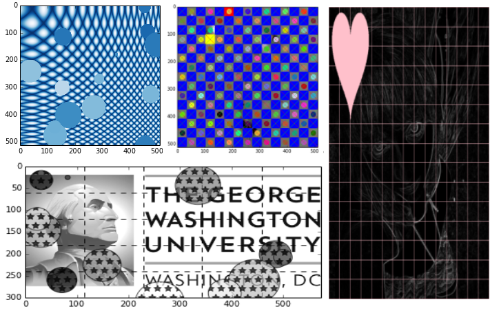

   
   
======================================
pyparty: Python (py) particles (party) 
======================================

``pyparty`` is a small library for drawing, labeling, patterning and manipulating 
particles in 2d images.  ``pyparty`` was built primarily over the excellent
image processing library, scikit-image_.

   .. _scikit-image: http://scikit-image.org


Getting Started
===============

The current documentation (and in-a-pinch test suite) is a series of example notebooks 
(`iPython Notebook`_), which cover most of the basics. These have been linked below:

- **TUTORIALS**:
   - `Intro to Canvas: Basic Operations`_ 
   - `Intro to Shapes`_
   - `Intro to Grids`_
   - `Intro to MultiCanvas`_
   
- **LABELS FROM IMAGES**:
   - `Labeling an Image`_
   - `Labeling Nanoparticle Species`_

- **MISCELLANEOUS**:
   - `Matplotlib Color Maps`_
   - `Watershedding Example Adapted`_

- **ARTIFICIAL IMAGES**:
   - `Basic Artificial SEM Images and Noise`_

- **COMING SOON**:
   - *Advanced artificial SEM/TEM images*
   
   .. _`Intro to Canvas: Basic Operations`: http://nbviewer.ipython.org/github/hugadams/pyparty/blob/master/examples/Notebooks/basictests.ipynb?create=1
   .. _`Intro to Shapes`: http://nbviewer.ipython.org/github/hugadams/pyparty/blob/master/examples/Notebooks/shapes.ipynb?create=1
   .. _`Intro to Grids` : http://nbviewer.ipython.org/github/hugadams/pyparty/blob/master/examples/Notebooks/grids.ipynb?create=1
   .. _`Intro to MultiCanvas` : http://nbviewer.ipython.org/github/hugadams/pyparty/blob/master/examples/Notebooks/multi_tutorial.ipynb?create=1
   .. _`Labeling an Image`: http://nbviewer.ipython.org/github/hugadams/pyparty/blob/master/examples/Notebooks/Analyze_Particles.ipynb?create=1
   .. _`Labeling Nanoparticle Species` :  http://nbviewer.ipython.org/github/hugadams/pyparty/blob/master/examples/Notebooks/groups_of_labels.ipynb?create=1
   .. _`Basic Artificial SEM Images and Noise` : http://nbviewer.ipython.org/github/hugadams/pyparty/blob/master/examples/Notebooks/making_noise.ipynb?create=1
   .. _`Matplotlib Color Maps` : http://nbviewer.ipython.org/github/hugadams/pyparty/blob/master/examples/Notebooks/gwu_maps.ipynb?create=1
   .. _`Watershedding Example Adapted` : http://nbviewer.ipython.org/github/hugadams/pyparty/blob/master/examples/Notebooks/watershed.ipynb?create=1

Notebooks were initialized with ``pylab``:

   ipython notebook --pylab=inline
   
Having trouble viewing/editing notebooks?  Consider using `Enthought
Canopy`_, which has a notebook kernel builtin, as well as a graphical package manager. 
For simple viewing, paste the github url of each notebook into the iPython Notebook viewer_. 
 
   .. _documentation: http://hugadams.github.com/pyparty/
   .. _`iPython Notebook`: http://ipython.org/notebook.html?utm_content=buffer83c2c&utm_source=buffer&utm_medium=twitter&utm_campaign=Buffer
   .. _`Enthought Canopy`: https://www.enthought.com/products/canopy/
   .. _viewer: http://nbviewer.ipython.org/   

**These notebooks are free for redistribution.  If referencing in publication, please cite as:**
        - Hughes, A. (2012). `A Computational Framework for Plasmonic Nanobiosensing`_.  Python in Science Conference [SCIPY]. 
  
   .. _`A Computational Framework for Plasmonic Nanobiosensing`: https://www.researchgate.net/publication/236672995_A_Computational_Framework_for_Plasmonic_Nanobiosensing:  
   
Overview and Features
=====================

``pyparty`` provides a simple API for particle analysis in 2d images, while streamlining some
common operations in the image processing pipeline.  

*Some key features include*:

1. Pythonic **ParticleManager** for storing and manipulating particles from image 
   labels OR builtin shapes.  Some highlights of **Particles** include:
       - A common datastructure for array operations like rotations and 
         translations.
       - ``skimage`` descriptors promoted as primary attributes.
       - Mapping and logical indexing (numpy style) on particle attributes, including
         descriptors. 
         
2. A **Grid** system for patterning particles, as well as mesh utilities for creating 
   image backgrounds.

3. A **Canvas** to easily integrate *Grids*, *Particles* and flexible *Backgrounds*. 
   In addition, Canvas also provides simplified interfaces for:
      - binarization / thresholding
      - plotting
      - pain-free access to colored, gray and binary image representations

4. A plotting API that supports both *matplotlib.imshow* AND `matplotlib patches`_.

5. Flexible color designations ('red', (1,0,0), 00FF00), and strict typing
   to ensure consistency in data and plots.

6. General ndarray operations such as rotations and translations supported by ALL particle types.

7. iPython Notebook tutorials.

In essence, ``pyparty`` integrates pre-existing plotting and image processing tools 
in a way that hopefully will help simplify many common operations, 
especially in regard to particle analysis.

   .. _`matplotlib patches` : http://matplotlib.org/examples/api/patch_collection.html

What are some use cases, and will pyparty help to me?
=====================================================

Some operations that ``pyparty`` would be particularly suited for would be:

1. Counting cells in an image and measuring their eccentricity.

2. Patterning a grid of particles over a shadowed background to compare performance
   of thresholding algorithms.

3. Manipulating particles based on descriptors.  For example:

   - delete all particles that have area > 50 pixels.
   - sort and color ellipses in order of increasing eccentricity.
   - dilate all particles appearing in bottom half of an image

4. Plot particles as masks, or matplotlib patches side-by-side.

In short, you may consider using ``pyparty`` if you are doing image analysis and find 
generating, managing or labeling particles as a bottleneck.  

   .. _patchcollection : http://matplotlib.org/examples/api/patch_collection.html

History
=======
``pyparty`` originally began at the George Washington University (2013) in an 
effort to generate test data for SEM and AFM images of gold nanoparticles on glass substrates.
We really enjoyed scikit-image_ for image processing and sought to implement it in generating test data.  
We sought to provide an API for managing labeled particles from real images.  Scikit-image draw and measure
modules laid the groundwork to the core functionality that ``pyparty`` attempts to streamline. 

I should also note that some of the inspiration can from the excellent ``Analyze Particles`` features
in ImageJ_.

   .. _ImageJ : http://rsbweb.nih.gov/ij/

License
=======

3-Clause Revised BSD_

   .. _BSD : https://github.com/hugadams/pyparty/blob/master/LICENSE.txt

Dependencies
============
``pyparty`` requires ``scikit-image``, ``Traits`` and their dependencies, which
include many core packages such as ``numpy`` and ``matplotlib``.  If you are new
to Python for scientific computing, consider downloading a packaged distribution_.

   .. _distribution :  https://www.enthought.com/products/canopy/

``pyparty`` uses Traits_ because it is well-suited for writing clean, type-checked
object-oriented classes. You will not need to understand or use ``Traits``
unless you develop for ``pyparty``; *it is not used in the public API*, and may be 
removed in future installments after the core functionality is stable.

   .. _Traits : http://code.enthought.com/projects/traits/
   
Installation
============

I would recommend using `Enthought Canopy`_ and installing ``Traits`` and 
``scikit-image`` through the package manager; however, ``pyparty`` is also 
registered in pip. (Checkit it out on PyPi_)

   .. _PyPi : https://pypi.python.org/pypi/pyparty

Pip Install
-----------

Make sure you have pip installed:

    sudo apt-get install python-pip
    
Then:
   
    pip install pyparty
    
To install all of the dependencies, download ``pyparty`` from github, navigate
to the base directory and type:

    pip install -r requirements.txt


Installation from source
------------------------

In the ``pyparty`` base directory run:

    python setup.py install

The developmental version can be cloned from github:

    git clone https://github.com/hugadams/pyparty.git
    
This will not install any dependencies (see above)
    
    
Related Libraries
=================
Interested in the Python ecosystem?   Check out some of these related libraries:

   - SciPy_ (Collection of core scientific libraries)
   - NumPy_ (Fundemental vectorized numerics package in Python)
   - matplotlib_ (Defacto static plotting in Python)
   - pandas_ (Data analysis library : inspired ``pyparty``` ParticleManager API)
   - ilastik_ (Interactive Learning and Segmentation Tool)
   - Pillow_ (Python Image Library)

   .. _Pillow: http://python-imaging.github.io/
   .. _NumPy: http://www.numpy.org/
   .. _pandas: http://pandas.pydata.org/
   .. _SciPy: http://scipy.org/
   .. _matplotlib : http://matplotlib.org/
   .. _ilastik : http://www.ilastik.org/
   
Coming Soon
===========
   - More multi-particle types.
   - Better control of color shading of labels.
   - More examples.
   
Have a feature request, or want to report a bug?  Please fill out a github
issue_ with the appropriate label.	

.. _issue : https://github.com/hugadams/pyparty/issues

About the Author
================

I'm a PhD student at GWU (check me out on researchgate_, Linkedin_ or twitter_)
and former Enthought intern. I work in biomolecule sensing and nanophotonics.  
Like any PhD student, my time is stretched across many projects.  As such,
the ``pyparty`` source code may is messy in places, and a test suite has
yet to be developed.  Developing the iPython notebook tutorials 
alongside the code helped served as a basic regression test platform.  

   .. _researchgate : https://www.researchgate.net/profile/Adam_Hughes2/?ev=hdr_xprf
   .. _Linkedin : http://www.linkedin.com/profile/view?id=121484744&goback=%2Enmp_*1_*1_*1_*1_*1_*1_*1_*1_*1_*1_*1&trk=spm_pic
   .. _twitter : https://twitter.com/hughesadam87

Acknowledgements
================
Thank you scikit-image team for their patience and assistance with us on the 
mailing list, and for putting together a great library for the community.

Thank you countless developers who have patiently answered hundreds of 
my questions on too many mailing lists and sites to list.

Thank you `Zhaowen Liu`_ for all of your help with this project, our 
other projects and for your unwaivering encouragement (and for the panda).

    .. _`https://github.com/EvelynLiu77`
